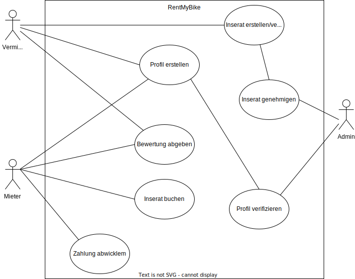

#  CREATE BOARD: MyApp

## IDEEN-BESCHREIBUNG
RentMyBike ist eine Peer-to-Peer-Motorradvermietungsplattform, die es Motorradbesitzern ermöglicht, ihre ungenutzten Motorräder zu vermieten und gleichzeitig interessierten Mietern kurzfristig und flexibel Zugang zu hochwertigen Motorrädern zu bieten. Sie bietet Flexibilität für Mieter und eine neue Einkommensquelle für Besitzer.

## ADRESSIERTE NUTZER
- Motorradbesitzer: Personen, die ein Motorrad besitzen, es aber nur selten nutzen, etwa nur an Wochenenden oder saisonal. Sie möchten ihre Motorräder nicht ungenutzt lassen und durch Vermietung zusätzlichen Gewinn erzielen.
- Motorradliebhaber und Gelegenheitsfahrer: Menschen, die ein Motorrad für Kurztrips oder gelegentlich mieten möchten, ohne in den vollen Besitz eines Motorrads zu investieren. Das schließt sowohl erfahrene Fahrer als auch Neueinsteiger ein.
- Touristen und Abenteurer: Reisende, die in fremden Städten oder Ländern Motorräder mieten wollen, um die Umgebung auf zwei Rädern zu erkunden.

## ADRESSIERTE BEDÜRFNISSE
- Für Besitzer: Zusätzliche Einnahmen durch die Vermietung eines ungenutzten Fahrzeugs, kombiniert mit der Sicherheit, dass das Motorrad gut versichert und geschützt ist.
- Für Mieter: Flexibler, schneller und kostengünstiger Zugang zu Motorrädern für kurzfristige Abenteuer oder gelegentliche Fahrten, ohne die langfristigen Verpflichtungen des Besitzes.
- Sicherheit: Beide Seiten benötigen Sicherheit und Vertrauen – Motorradbesitzer wollen sicher sein, dass ihre Motorräder gut behandelt werden, und Mieter wollen versichert sein, dass sie im Schadensfall geschützt sind.

## PROBLEME
- Vertrauen und Sicherheit: Motorradbesitzer haben Bedenken, ihre teuren und oft emotional wertvollen Motorräder an Fremde zu vermieten, aus Angst vor Schäden oder Missbrauch.
- Flexibilität: Es gibt derzeit nur wenige flexible Optionen für Motorradfahrer, die Motorräder kurzfristig und unkompliziert mieten möchten, insbesondere für kurze Zeiträume oder einmalige Anlässe.
- Komplizierte Versicherung: Der Versicherungsschutz bei Motorradvermietungen ist oft komplex und schwer verständlich. Viele Mietoptionen decken nicht alle Risiken ab.

## IDEENPOTENZIAL
Mehrwert: Mückenstich vs. Hai-Attacke

🔵🔵🔵🔵⚪️⚪️⚪️⚪️⚪️⚪️
dressiert ein bestehendes Bedürfnis nach kurzfristigen Mobilitätslösungen und dem effektiveren Einsatz von Ressourcen, ähnlich einem „Mückenstich“.

Übertragbarkeit: Robinson Crusoe vs. die Welt

🔵🔵🔵🔵🔵🔵🔵⚪️⚪️⚪️
Die Idee ist gut übertragbar auf verschiedene Länder und Märkte, da Motorräder weltweit beliebt sind und der Trend zur Sharing Economy global an Bedeutung gewinnt.

Machbarkeit: Hammer vs. Raumschiff

🔵🔵🔵🔵🔵🔵🔵🔵⚪️⚪️
Die technische und organisatorische Machbarkeit ist hoch. Viele der benötigten Technologien, wie Versicherungsintegration und Plattformmanagement, existieren bereits. Es handelt sich eher um einen „Hammer“ als ein „Raumschiff“, was die Umsetzbarkeit angeht.

## DAS WOW
Sofortige Verfügbarkeit eines Motorrads in deiner Nähe mit nur wenigen Klicks – alles versichert und geschützt."
Wir werden dafür gefeiert, dass wir die Flexibilität und Einfachheit von Carsharing auf den Motorradmarkt gebracht haben und den Mietprozess so intuitiv gestaltet haben, dass jeder Motorradfahrer schnell und sicher ein Motorrad mieten kann.

## HIGH-LEVEL-KONZEPT
„Airbnb für Motorräder“ – Die Plattform funktioniert wie ein Marktplatz für Motorräder, bei dem Privatpersonen ihre Motorräder sicher und flexibel vermieten können, ähnlich wie Airbnb es für Wohnungen ermöglicht.

## WERTVERSPRECHEN
RentMyBike bietet Motorradbesitzern die Möglichkeit, ihr Motorrad einfach und sicher zu vermieten, während es Motorradfahrern flexible und bequeme Miete ermöglicht. Durch ein transparentes System mit Versicherungen, Bewertungen und klaren Buchungsprozessen schafft die Plattform Vertrauen und eröffnet neue Möglichkeiten für Motorradliebhaber und Abenteuerlustige gleichermaßen.
