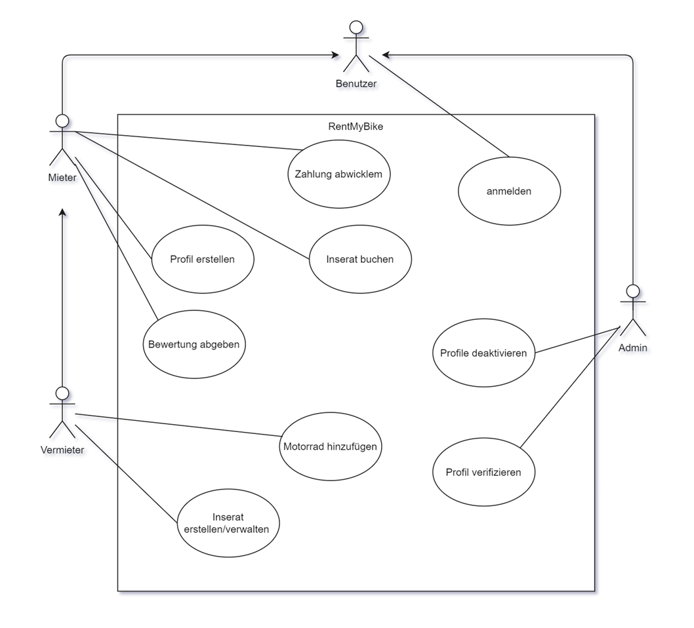
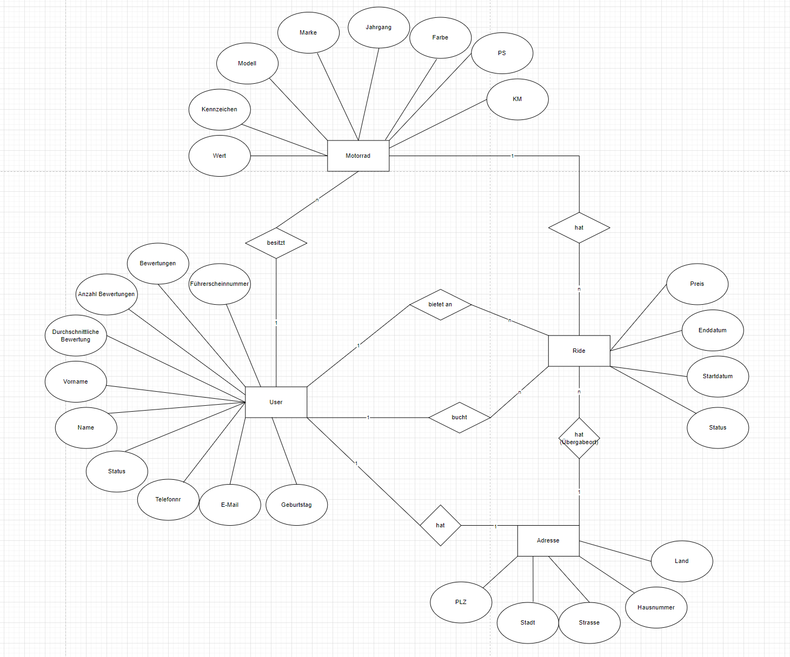
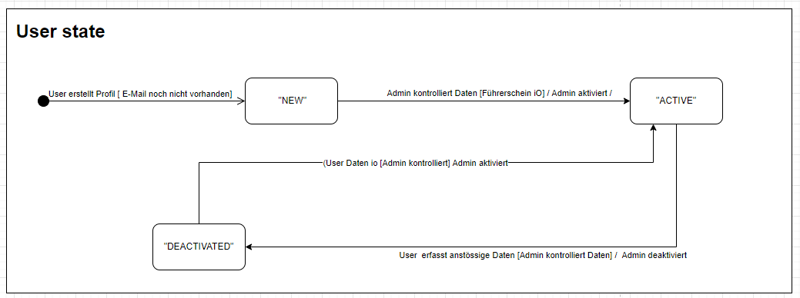
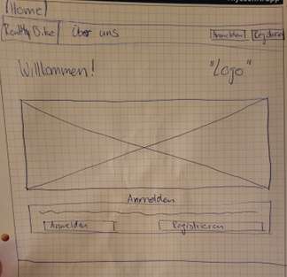
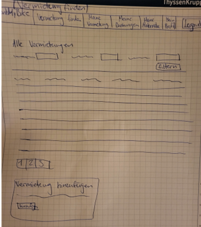
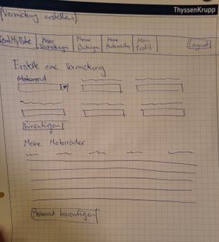
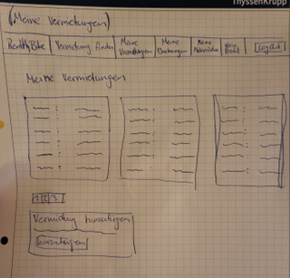
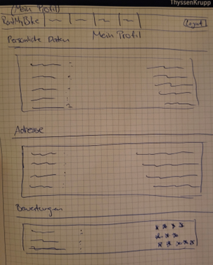

# Anforderungen

## Use-Case-Diagramm

Die wichtigsten Use-Cases habe ich im Use-Case Diagramm erfasst. Es existieren noch weitere Use-Cases, welche ich aus Gründen der Übersicht nicht im Diagramm miteinbezogen habe:
- Alle Benutzer ansehen (Admin)
- Alle Fahrzeuge ansehen (Admin)
- Alle Vermietungen ansehen (Admin)
- Profilinformationen bearbeiten (Benutzer)

---

---

## Use-Case-Beschreibung

### Titel: Profil erstellen
- **Akteur:** Alle Benutzer
- **Beschreibung:** Der Benutzer registriert sich.
- **Auslöser:** Benutzer kommt auf die Plattform.
- **Vorbedingungen:** -

---

### Titel: Anmelden
- **Akteur:** Alle Benutzer
- **Beschreibung:** Der Benutzer meldet sich mit seinen Daten an.
- **Auslöser:** Benutzer kommt auf die Plattform.
- **Vorbedingungen:** Der Benutzer hat ein Profil erstellt.

---

### Titel: Profil verifizieren
- **Akteur:** Administrator
- **Beschreibung:** Der Administrator überprüft die Daten des Benutzers und schaltet diesen frei.
- **Auslöser:** Administrator sieht Liste mit allen Benutzern und Status.
- **Vorbedingungen:** Der Benutzer hat ein Profil erstellt.

---

### Titel: Profil deaktivieren
- **Akteur:** Administrator
- **Beschreibung:** Der Administrator kann das Profil deaktivieren.
- **Auslöser:** Administrator sieht Liste mit allen Benutzern.
- **Vorbedingungen:** Profil enthält anstößige Bezeichnungen.

---

### Titel: Motorrad hinzufügen
- **Akteur:** Vermieter
- **Beschreibung:** Der Vermieter kann ein Motorrad zum späteren Gebrauch erfassen.
- **Auslöser:** Vermieter hat Zugang zu Erfassungsmaske.
- **Vorbedingungen:** Vermieter ist angemeldet und verifiziert.

---

### Titel: Inserat erstellen/verwalten
- **Akteur:** Vermieter
- **Beschreibung:** Der Vermieter kann mit seinem Motorrad eine Vermietung anbieten.
- **Auslöser:** Vermieter hat Zugang zu Erfassungsmaske und klickt auf Erstellen/Anpassen.
- **Vorbedingungen:** Vermieter ist angemeldet und verifiziert.

---

### Titel: Inserat buchen
- **Akteur:** Mieter
- **Beschreibung:** Der Mieter bucht eine inserierte Fahrt.
- **Auslöser:** Mieter hat eine Fahrt gefunden, die passt.
- **Vorbedingungen:** Mieter ist angemeldet und verifiziert.

---

### Titel: Bewertung abgeben
- **Akteur:** Vermieter/Mieter
- **Beschreibung:** Der Vermieter/Mieter bewertet die andere Person.
- **Auslöser:** Vermieter/Mieter gibt in einem Bewertungssystem die Bewertung ab.
- **Vorbedingungen:** Vermieter/Mieter ist angemeldet und verifiziert.

---

### Titel: Zahlung abwickeln
- **Akteur:** Mieter
- **Beschreibung:** Der Mieter bezahlt für die Vermietung.
- **Auslöser:** Mieter kann über Banküberweisung oder sogar Twint bezahlen.
- **Vorbedingungen:** Mieter ist angemeldet und verifiziert.

## ER-Modell

# Eläuterung zu den Entitäten, Attributen und Beziehungen

## 1. Entität: User
### Attribute:
- **Vorname:** Der Vorname des Benutzers.
- **Name:** Der Nachname des Benutzers.
- **Status:** Gibt an, ob der Benutzer neu (nciht verifiziert), verifiziert (aktiv) oder deaktiviert ist.
- **Telefonnummer:** Die Kontakttelefonnummer des Benutzers.
- **E-Mail:** Die E-Mail-Adresse des Benutzers.
- **Geburtstag:** Das Geburtsdatum des Benutzers.
- **Führerscheinnummer:** Nummer des Führerscheins, um die Fahrberechtigung zu überprüfen.
- **Bewertungen:** Alle Bewertungen, die der Benutzer bekommen hat
- **Anzahl Bewertungen:** Anzahl der Bewertungen, die der Benutzer erhalten hat, um Durschnitt zu berechnen.
- **Durchschnittliche Bewertung:** Der durchschnittliche Bewertungsscore des Benutzers.

### Beziehungen:
- **besitzt → Motorrad:** Ein Benutzer kann eine oder mehrere Motorräder besitzen.
- **bietet an → Ride:** Ein Benutzer kann eine oder mehrere Vermietungen (Rides) anbieten.
- **bucht → Ride:** Ein Benutzer kann eine oder mehrere Vermietungen buchen.
- **hat → Adress:** Eine Adresse ist mit einem User verknüpft und definiert den Wohnort.

---

## 2. Entität: Motorrad
### Attribute:
- **Marke:** Die Marke des Motorrads (z. B. Yamaha, Ducati).
- **Modell:** Das spezifische Modell des Motorrads.
- **Jahrgang:** Das Baujahr des Motorrads.
- **Farbe:** Die Farbe des Motorrads.
- **PS:** Die Leistung in Pferdestärken (PS).
- **KM:** Kilometerstand des Motorrads.
- **Kennzeichen:** Nummernschild des Motorrads.
- **Wert:** Der geschätzte Wert des Motorrads in der Währung der Plattform.

### Beziehungen:
- **besitzt → User:** Ein Motorrad wird von einem Benutzer (Vermieter) besessen.
- **hat → Ride:** Ein Motorrad wird für ein oder mehrere Vermietungen genutzt.

---

## 3. Entität: Ride (Vermietung)
### Attribute:
- **Preis:** Der Mietpreis für den Ride.
- **Startdatum:** Das Startdatum der Vermietung.
- **Enddatum:** Das Enddatum der Vermietung.
- **Status:** Der Status des Rides (verfügbar, gebucht, abgeschlossen).

### Beziehungen:
- **hat → Motorrad:** Ein Ride ist mit einem bestimmten Motorrad verbunden.
- **bucht → User:** Ein Ride wird von einem Benutzer gebucht.
- **bietet an → User:** Ein Ride wird von einem Benutzer (Vermieter) angeboten.
- **hat Übergabeort → Adresse:** Ein Ride ist mit einer Abhol- und Rückgabeadresse verbunden.

---

## 4. Entität: Adresse
### Attribute:
- **Land:** Das Land, in dem die Adresse liegt.
- **Stadt:** Die Stadt der Adresse.
- **PLZ:** Die Postleitzahl der Adresse.
- **Strasse:** Die Straße, auf der sich die Adresse befindet.
- **Hausnummer:** Die Hausnummer der Adresse.

### Beziehungen:
- **hat → Ride:** Eine Adresse ist mit einem Ride verknüpft und definiert den Abhol- und Rückgabeort.
- **hat → User:** Eine Adresse ist mit einem User verknüpft und definiert den Wohnort.
---

Dieses Modell spiegelt eine Plattformstruktur wider, die eine klare Trennung der Entitäten bietet und durch die Beziehungen eine flexible, aber strukturierte Organisation der Daten ermöglicht.

## Zustandsdiagramm

# Nicht-funktionale Anforderungen für RentMyBike

## 1. Skalierbarkeit
- Die Anwendung muss skalierbar sein, um zukünftige Anforderungen und einen wachsenden Benutzerstamm zu unterstützen.
- Das System soll horizontal und vertikal skalierbar sein, um erhöhte Lasten effizient zu bewältigen.

## 2. Sicherheit
- Alle Benutzeranmeldungen und -interaktionen müssen über HTTPS erfolgen.
- Passwörter und sensible Daten müssen sicher verschlüsselt gespeichert werden.
- Die JWT-Authentifizierung muss verwendet werden, um autorisierten Zugriff auf APIs sicherzustellen.
- Regelmäßige Sicherheitsprüfungen (z. B. gegen SQL-Injections und XSS) sollen implementiert werden.

## 3. Wartbarkeit
- Der Code soll modular und gut dokumentiert sein, um zukünftige Änderungen und Erweiterungen zu erleichtern.
- Logs sollen generiert und sinnvoll strukturiert sein, um die Fehlersuche zu erleichtern.

## 4. Benutzerfreundlichkeit (Usability)
- Das Frontend soll eine intuitive und leicht verständliche Benutzeroberfläche bieten, die für mobile und Desktop-Geräte optimiert ist.
- Benutzer sollen wichtige Funktionen (z. B. Motorrad suchen, Vermietung erstellen) ohne vorherige Schulung nutzen können.

## 5. Kompatibilität
- Die Anwendung soll in allen gängigen Webbrowsern (z. B. Chrome, Firefox, Safari, Edge) korrekt funktionieren.
- Das System muss auf verschiedenen Geräten wie Smartphones, Tablets und Desktops nutzbar sein.

## 6. Fehlerbehandlung
- Fehlermeldungen sollen präzise und benutzerfreundlich sein.
- Kritische Fehler müssen automatisch geloggt und Administratoren gemeldet werden.

## Mockup/Skizze von UIs

Bevor ich mit der Umsetzung begann, habe ich mir Gedanken über das Design des Frontends gemacht. Dabei habe ich Skizzen der wichtigsten Seiten erstellt, um eine klarere Vorstellung von der Gestaltung zu erhalten. Diese Vorbereitungen halfen mir, das Gesamtbild besser zu visualisieren, bevor ich mit der eigentlichen Entwicklung startete.

## UI Mockups

### Home

### Vermietung finden

### Vermietung erstellen

#### Meine Vermietungen

#### Mein Profil

---
