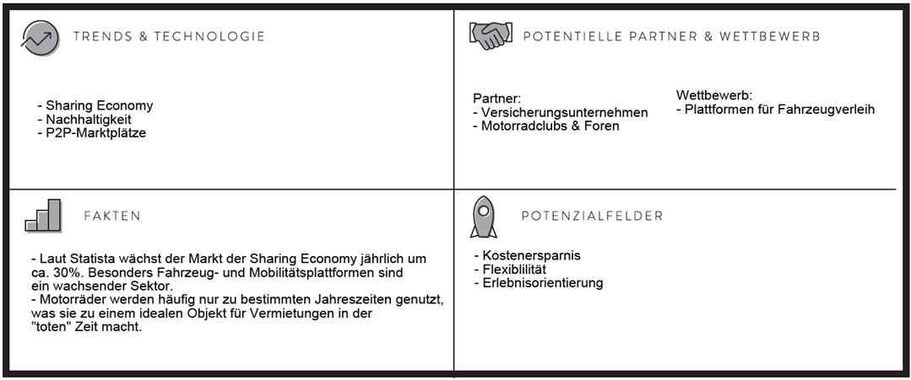
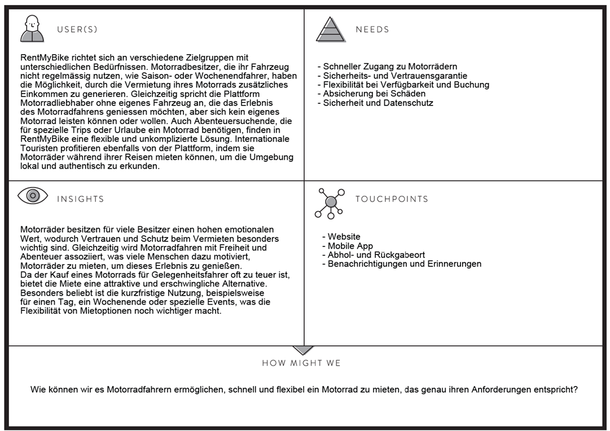
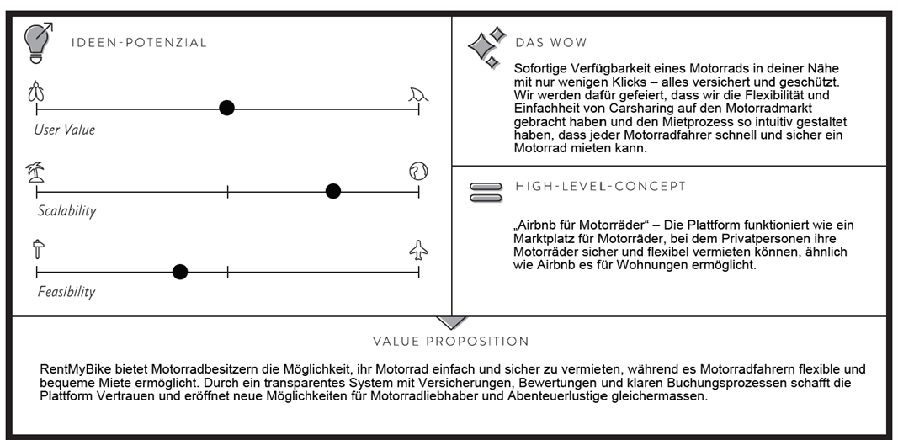
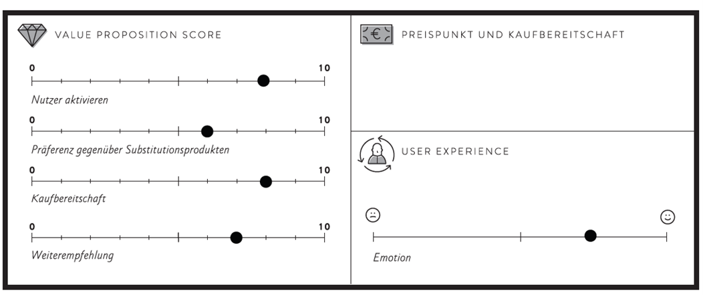
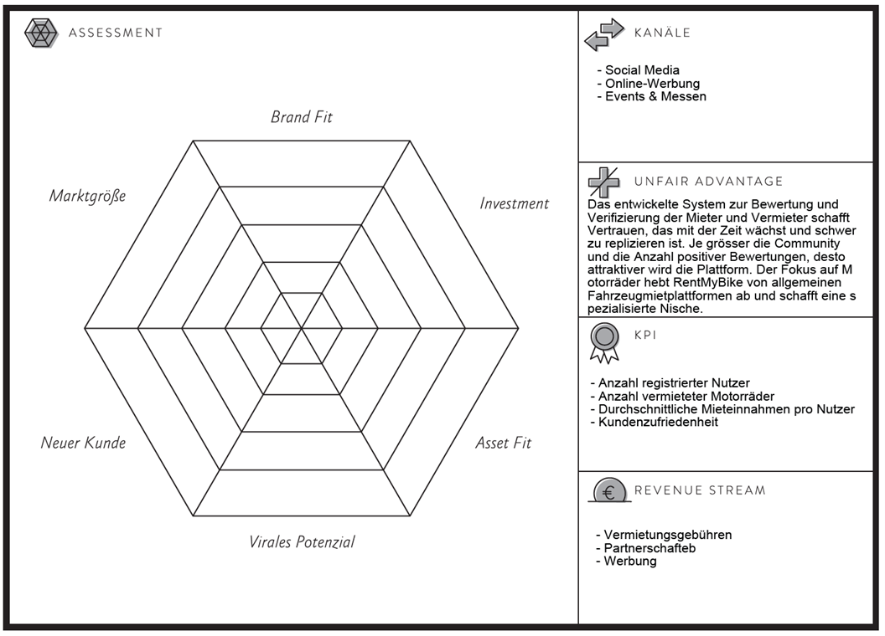

# Einleitung
RentMyBike ist eine innovative Peer-to-Peer-Plattform, die Motorradbesitzern ermöglicht, ihre ungenutzten Fahrzeuge sicher und flexibel zu vermieten. Gleichzeitig bietet sie Gelegenheitsfahrern und Abenteurern schnellen und einfachen Zugang zu Motorrädern für ihre individuellen Bedürfnisse. Die Plattform vereint Mobilität, Flexibilität und Sicherheit, um ein einzigartiges Erlebnis für Nutzer zu schaffen.

---

## Problemstellung
Motorräder werden häufig nur saisonal oder sporadisch genutzt, wodurch sie oft ungenutzt in Garagen stehen und Kosten verursachen. Gleichzeitig gibt es viele Menschen, die für kurze Zeiträume, wie Wochenendtrips oder Reisen, ein Motorrad mieten möchten, jedoch keinen Zugang zu flexiblen und einfachen Mietoptionen haben. Zusätzlich erschweren Unsicherheiten bei Versicherung und Vertrauen den Mietprozess für sowohl Besitzer als auch Mieter. Es fehlt eine spezialisierte Plattform, die diese Bedürfnisse adressiert und eine sichere sowie unkomplizierte Lösung bietet.

---

## Projektidee
RentMyBike ist eine Plattform, die Motorradbesitzern ermöglicht, ihre Fahrzeuge sicher und flexibel zu vermieten, während Mieter unkompliziert und schnell ein passendes Motorrad für ihre individuellen Bedürfnisse finden können.  

### Ziele der Plattform:
- Effizientere Nutzung ungenutzter Motorräder.
- Erleichterter Zugang zu Motorrädern für Gelegenheitsfahrer und Abenteurer.
- Kombination aus einfacher Bedienung, Sicherheit und Transparenz.  

Die Plattform wird durch Versicherungen, Nutzerbewertungen und einen klaren Buchungsprozess unterstützt. Besitzer profitieren von einer zusätzlichen Einnahmequelle, während Mieter eine flexible und kosteneffiziente Alternative zum Motorradbesitz erhalten.  

RentMyBike bringt eine lebendige Community hervor, die Mobilität, Abenteuer und Flexibilität miteinander verbindet und die Sharing Economy im Bereich Motorräder nachhaltig voranbringt.

---

## Benutzergruppen
RentMyBike richtet sich an verschiedene Benutzergruppen mit unterschiedlichen Bedürfnissen und Zielen.

### Motorradbesitzer
Personen, die ein Motorrad besitzen, es jedoch selten nutzen, wie Saison- oder Wochenendfahrer.  
- **Bedürfnis:** Zusätzliche Einnahmen generieren und Sicherheit gewährleisten.  
- **Lösung:** Versicherungen und Bewertungen schaffen Vertrauen und Schutz.  

### Motorradliebhaber und Gelegenheitsfahrer
Menschen ohne eigenes Motorrad, die gelegentlich fahren möchten.  
- **Bedürfnis:** Einfache und kostengünstige Möglichkeit, ein Motorrad für Kurztrips oder besondere Erlebnisse zu mieten.  
- **Lösung:** Schneller Zugang zu hochwertigen Motorrädern ohne Verpflichtungen eines Besitzes.  

### Touristen und Abenteuersuchende
Reisende, die während ihres Urlaubs oder Abenteuers Motorräder mieten möchten.  
- **Bedürfnis:** Lokale Verfügbarkeit und nahtloser Mietprozess.  
- **Lösung:** Flexibler Zugang zu Motorrädern vor Ort.

---

## Explore-Board

---

## Create-Board

---

## Evaluate-Board

---

## Feedback zum Pitch
Zu den wichtigsten Rückmeldungen aus dem Pitch gehören folgende Punkte:

### 1. Schadensfall und Sicherheit
-   Wie wird ein Schadensfall abgewickelt? (Meldung, Reparatur, Abwicklung).
-   Wie wird verhindert, dass Motorräder gestohlen werden, da sie leichter zu stehlen sind?

### 2. Qualität und Wartung der Motorräder
-	Wie wird die Qualität und der Zustand der Motorräder sichergestellt?
-	Wer führt die Wartung der Fahrzeuge durch?

Damit auch bei einem Schadensfall der Vermieter sowie der Mieter geschützt wird, ist geplant, dass beide Parteien durch eine integrierte Versicherung geschützt sind. Diese Versicherung wird im Ge-samtpreis der Vermietung dazugerechnet. Der Vermieter kann mur ein eingelöstes Motorrad mit einem gültigen Nummernschild vermieten und ist bei zusätzlichem nachweisbarem Makel am Mo-torrad abgesichert. Währenddem der Mieter bei normalem Umgang mit dem Motorrad ebenfalls versichert wird, ausgeschlossen bei fahrlässigem Handeln im Strassenverkehr.

Dass ein Motorrad gestohlen wird, ist ein generelles Problem bei Motorrädern. Da können wir mit der App als Vermittler leider nicht dagegenwirken. Dazu wird je nach Handlungsablauf die Versi-cherung des Motorradbesitzer oder die Haftpflicht-Versicherung des Mieters den aufgekommenen Schaden abdecken.

Die Qualität und der Zustand eines Motorrads sollten bei einer Vermietung makellos sein. Deshalb wird zuerst einmal mit dem Kennzeichen geprüft, ob das Motorrad eingelöst ist und kein MFK aus-steht. Auf kleinere Makel haben wir keine Möglichkeit darauf einzugehen. Deshalb soll hier unser Bewertungssystem Vertrauen schaffen. Der Mieter kann den Vermieter und dessen Motorrad be-werten und diese Bewertungen werden gespeichert und allen potenziellen Mietern zur Verfügung gestellt. Der Vermieter hat ebenfalls die Möglichkeit den Mieter zu bewerten und allenfalls den Rückgabezustand des Motorrads zu dokumentieren. So soll eine transparente Lösung geschaffen werden.

Die Verantwortung der Wartung des Motorrads liegt bei dem Besitzer. Wir kontrollieren nur, ob das Motorrad eine Strassenzulassung hat. Wir gehen davon aus, dass alle Motorräder gewartet sind, da diese auch von dem Besitzer gefahren werden und Sicherheit ein zentraler Punkt beim Motor-radfahren ist. Falls es trotzdem mal zu negativen Zwischenfällen kommt, kann man das im Bewer-tungssystem erfassen.

