# Implementation

## Beschreibung des Frontends

### Home-Page

Auf der Homepage wird der Benutzer ertsmals begrüsst und kann isch unten über eien Card oder oben rechts mit den Buttons anmelden oder Registrieren. Ausserdem ist eine zusätzliche Seite "Über uns" zu sehen. Diese Views benötigen keine weitern Zugriffberechtigungen und sind immer zu sehen.

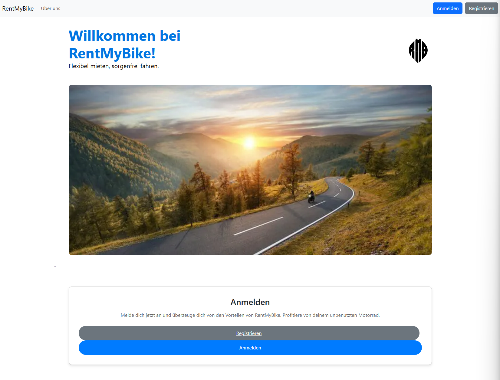

Nach dem Anmelden erscheinen in der Navigationsleiste alle Views die für einen User freigeschaltet sind. Neu wird auf der Homepage die Möglichkeit angeboten eine Vermietung hinzufügen oder seine Profildaten zu vervollständigen. In der naviagtionsleist ist nun die eigene E-Mail ersichtlich und der Button, um sich auszuloggen.

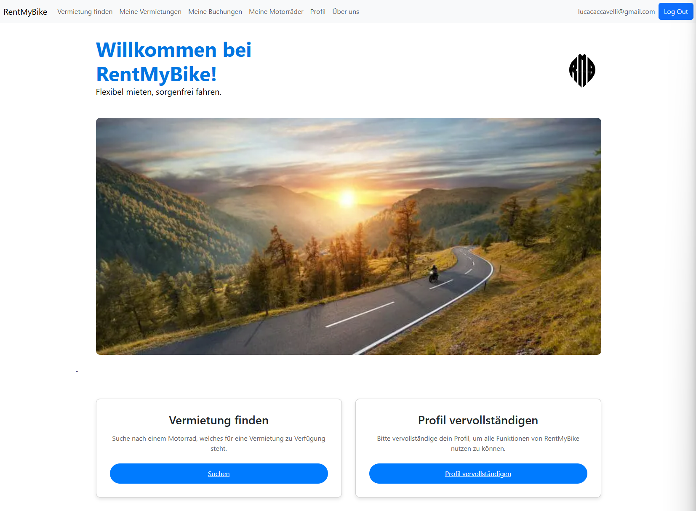

### Anmeldung und Registrierung

Der User kann sich über folgende Maske anmelden oder Registrieren. Sowohl bei der Anmeldemaske als auch bei der Registrationsmaske kann man entweder in die Anmeldung oder Registration wechseln. 

 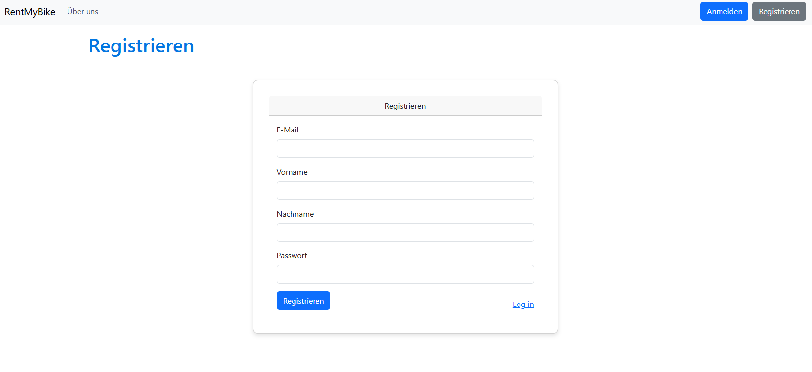

### Benutzerdaten vervollständigen

Sobald sich der User angemeldet hat, kann dieser die Benutzerdatenvervollständigen. In diesem Formular werden die Daten Name, Nachname und E-Mail aus dem Login übernommen und sind nicht mehr veränderbar (readonly). Die weiteren Angaben zum Profil, kann der Benutzer nun ergänzen.

### Vermietung finden

Auf der Seite "Vermietung finden" hat der User eine Übersicht aller verfügbaren Vermietungen. Es werden wichtige Informationen zu dem Motorrad der Vermietung in der ersten Spalte angezeigt. Ausserdem wird der Zeitraum der vermitung sowie der Standort angezeigt. Dieser ist vorerst noch auf Land und Stadt begrenzt, damit nicht schon von Anfang an die kompletten Adressdaten sichtbar sind. Zusätzlich wird der Preis angezeigt und mit dem Button "Buchen" kann man die Vermietung auf den eigenen User buchen. 

Zusätzlich werden einem viele Filtermöglichkeiten zur Vefügung gestellt. Diese können auch in Kombination verwendet werden. Es wurden möglichst viele Filtermöglichkeiten abgedecket und mit den Queries im RideRepository erstellt.
Als Beispiel, Stadt = Zürich und max Preis = 150: http://localhost:8080/rides/ridesOverview?page=1&minPrice=null&maxPrice=150&city=Z%C3%BCrich&startTime=&endTime=

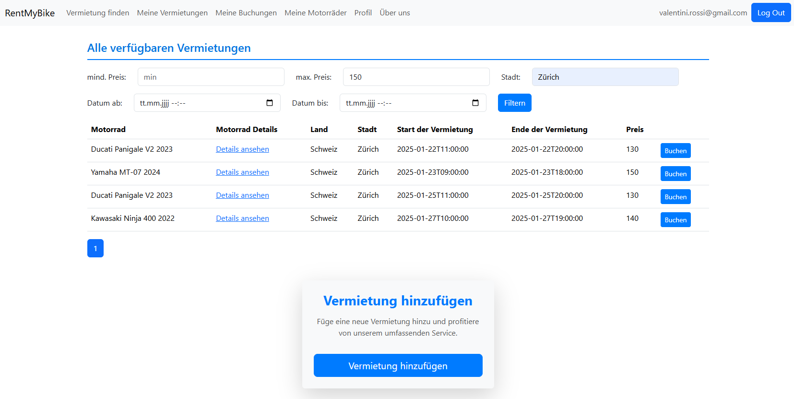

### Motorrad Details

Falls man noch weitere Details zum Motorrad ansehen möchte, kann man auf die Details klicken und es wird eine Seite mit allen Werten dieses Motorrad aufgerufen. Da es sich um eine dynamische Route handelt, werden immer nur die Daten des ausgewählten Motorrads geladen.

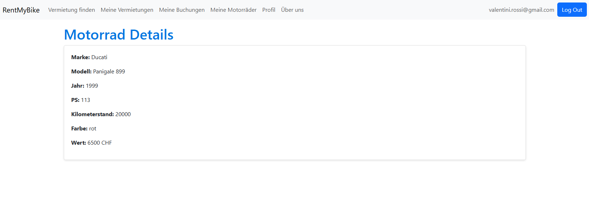

### Vermietung erstellen

Im untern Bereich wird ein auffälliger Button angezeigt, welcher dazu animiert, eine weitere Vermietung zu erstellen.
Sobald man den Button betätigt, erscheint eine Erfassungsmaske. In dieser Maske müssen alle nötigen Attribute zu einer Vermietung erfasst werden. Sobald man diese hinzufügt, wird diese unter "Meine Vermietungen" und "Vermietung finden" aufgelistet. Wichtig ist, dass der Benutzer bereits den Status "Aktiv" hat. Wenn sich der Benutzers registriert und seine Daten vervollständigt hat dieser noch dne Status "neu", womit dieser noch nicht Berechtigt ist. Erst soblad der Administrater die Benutzerdaten geprüft hat und den User aktiviert, ist das Erstellen einer Vermietung möglich.

Zusätzlich hat man noch eine Übersicht der eigenen Motorräder. Den das Motorrad muss für eine Vermietung ebenfalls defniert werden. 
Man hat sogleich die Möglichkeit über den Löschen-Button ein Motorrad zu löschen oder über den Motorrad hinzufügen Button ein weiters Mottorad zu erfassen. 

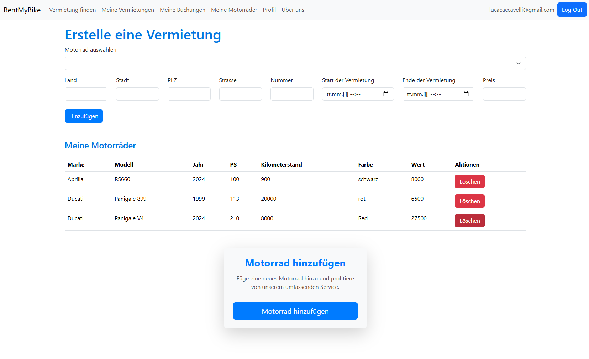

### Auswahlliste der Motorräder

Damit der User auch sicher das richtige Motorrad auswählt, kann man über die Motorradauswahl eine Dropdwon Liste der eigenen Motorräder öffnen. Dort werden einem die eigenen Motorräder zur Verfügung gestellt und automatisch die korrekte Zuweisung vorgenommen. 
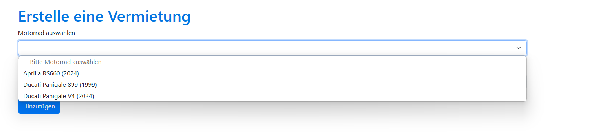

### Motorrad erstellen

Sobald man auf den Button "Motorrad hinzufügen" klickt, wird man zum Erstell-Formualr weitergeleitet. Auf dieser Seite kann man alle Angaben zum Motorrad angeben und es wird direkt auf den User geschrieben. Mit dem Button "Erstellen" werden die Daten gespeichert und mit dem Button "zurück" wird man wieder auf die vorherige Seite weitergeleitet. 

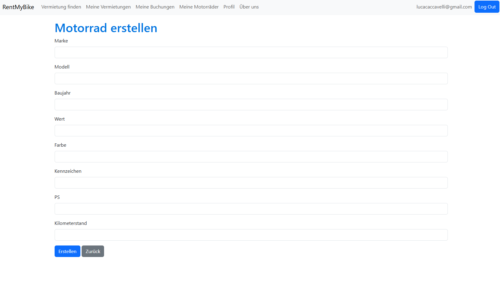

### Meine Motorräder

Damit man eine eigene übersichtliche Auflistung der eigenen Motorräder hat, wurde zusätzlich die Seite "Meine Motorräder" erstellt.
Auf dieser Seite werden alle Motorräder und deren Attrinute aufgelistet und können gelöscht oder neu erstellt werden.

### Meine Buchungen

Sobald ein User eine Fahrt (Vermietung) gebucht hat, wird diese auf der Seite "Meine Buchungen" angezeigt. Auf der Seite werden die einzelnen Buchungen in Container bzw. Cards unterteilt, da es nicht so eine grosse Auflistung, wie bei allen Vermietungen, ist und so mehr Informationen übersichtlicher dargestellt werden. 

In diesen Container sieht man nun nochmals alle wichtigen Informationen zur Buchung, wie z.B: die Daten des Motorrads, das Start- und Enddatum der Vermietung, den Preis, sowie den Status. In diesen Cards kann die Buchung entweder den Status "gebucht" oder "abgeschlossen" haben. Den Status an sich kann man als Mieter nicht ändern, das geht nur als Vermieter. Damit der Mieter bei einem Schadensfall oder sonstigen Problemen den Vermieter kontaktieren kann, werden in dieser Übersicht ebenfalls die Kontaktdaten des Vermieters angezeigt. 

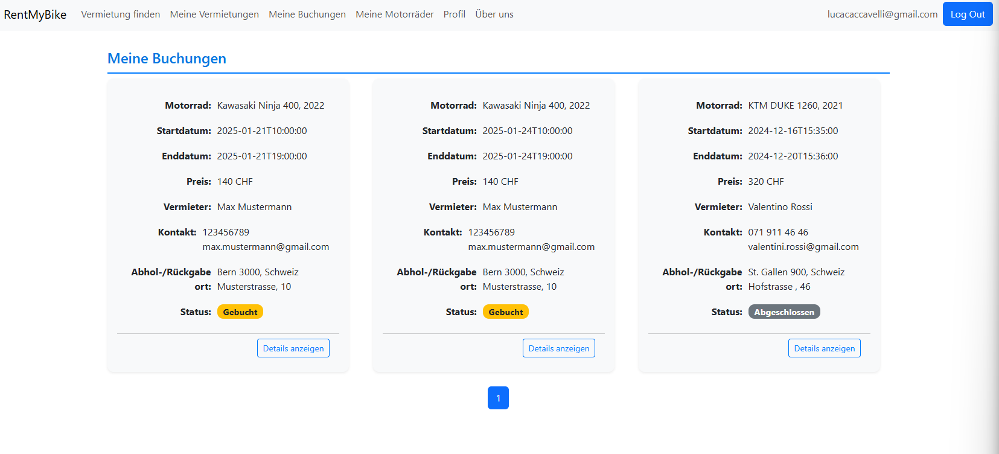

### Meine Vermietungen

Wenn ein User eine Fahrt angeboten hat bzw. eine Vermietung erstellt hat, sind diese alle auf dieser Seite aufgeführt. Dabei unterscheiden wir bei der Vermietung von drei Status: 
- verfügbar: Die Vermietung ist noch aufgeschalten und noch von keine User gebucht worden.
- gebucht: Die Vermietung wurde gebucht und ist nicht mehr aufgeschalten.
- abgeschlossen: Die Vermietung wurde gebucht, das Motorrad ist zurück und der Preis wurde bezahlt.

Auch hier werden Cards ausgewiesen, um möglichst viele Infos auf einmal übersichtlich darzustellen. Es werden ebenfalls die wichtigsten Infos zum Motorrad, die Vemrietungsdauer, der Preis, der Abhol- und Rückgabeort sowie der Status angezeigt. Sobald die Vermietung gebucht wird, sind auch noch Informationen zum Mieter ersichtlich.

Im Status "gebucht" hat der Vermieter die Möglichkeit, die Fahrt mit dem Button abzuschliessen. Somit ist die Vermietung abgeschlossen.

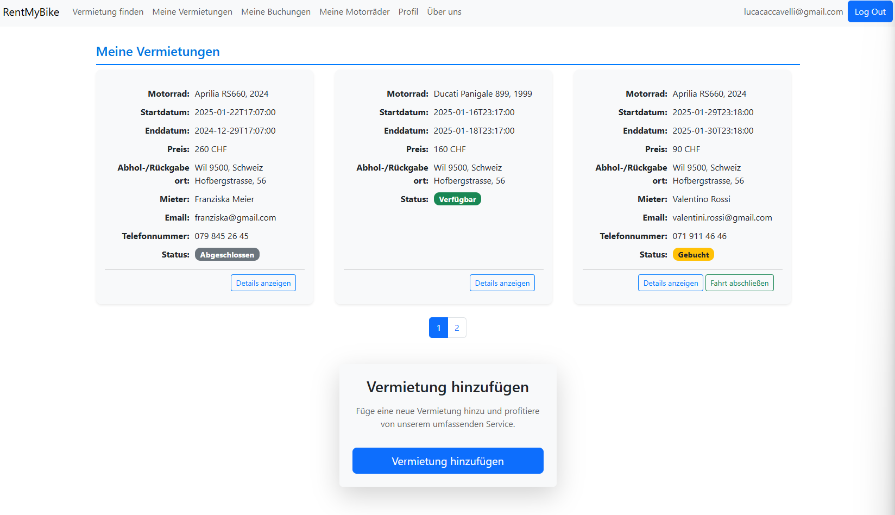

### Mein Profil

Auf dieser Seite kann der Benutzer seine eigenen Daten einsehen. Es werden zusätzlich noch der Status des Benuters sowie die Benutzerrolle ausgewiesen (falls vorhanden). Sobald der User eine Bewertung erhält wird diese ebenfalls aufgelistet. Im unteren Bereich ist auch noch eine kleine Auflistung der eigenen Buchungen und der angebotene Vermietungen zu sehen.

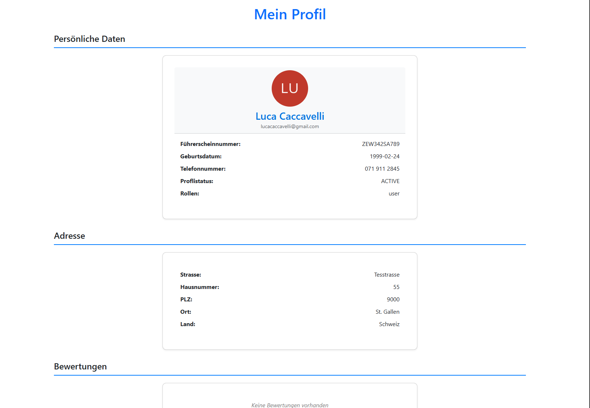

## Seiten für Administrator

Der Administrator hat in der Webbappliaktion eher eine verwaltende Rolle und deshalb Zugriff auf andere Seiten

### Benutzerverwaltung

Auf dieser Seite hat der Administrator Einsicht auf alle Benutzer und sieht deren Benutzerdaten inkl. den Status. Die Benutzer mit dem Status NEW kann man prüfen und mit den Aktionsbuttons entweder aktivieren oder deaktivieren. Ein aktiver Benutzer kann nur deaktiviert werden und ein deaktvierter Benutzer kann nur aktiviert werden. Um die neue Benutzer schneller zu finden, existiert auch eine Filtermöglichkeit auf den Status. 

### Alle Motorräder

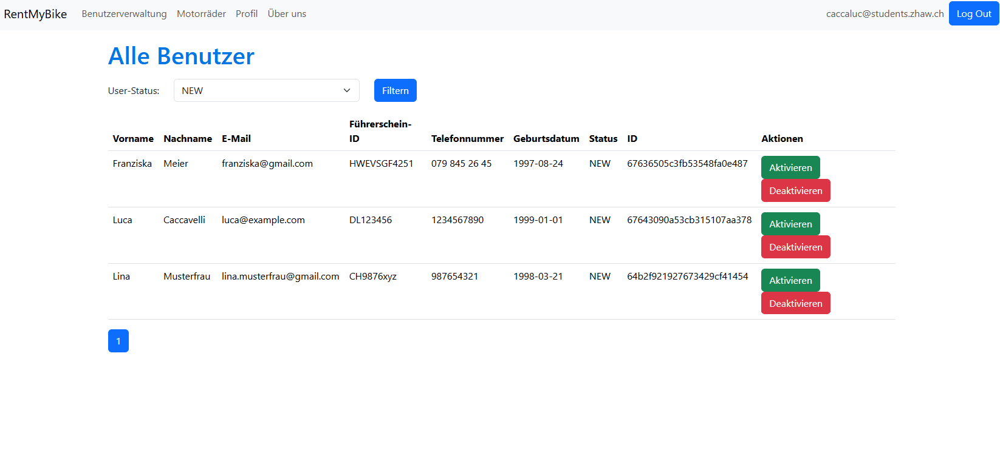

Zusätzlich hat der Administrator Zugriff auf eine Auflistung aller Motorräder, die erfasst worden sind.

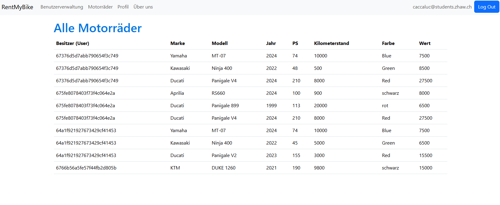