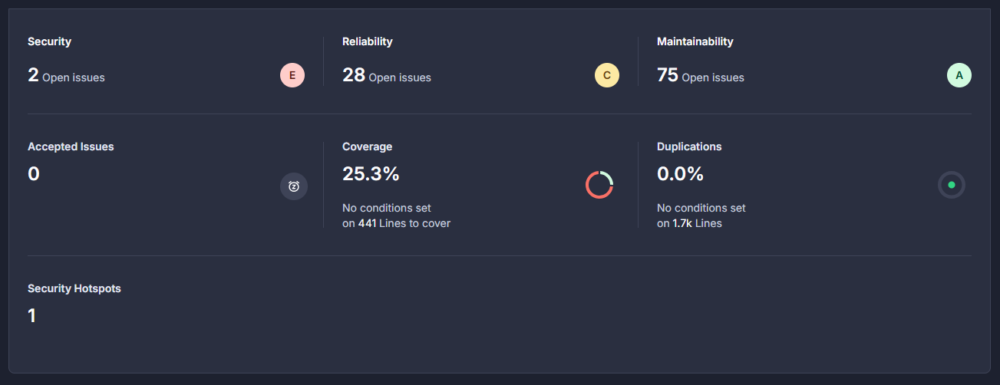
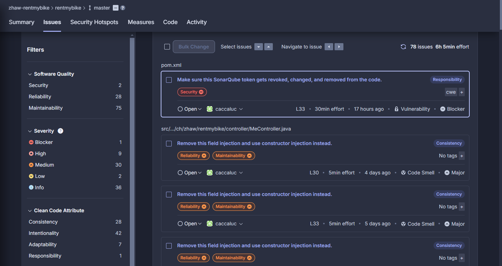

# Testing

## Tests der Modultests und Datenübertragungsklassen

Die Tests weisen eine ähnliche Struktur und Vorgehensweise auf, weshalb auf eine ausführliche Beschreibung jedes einzelnen Tests verzichtet wurde. Sie folgen einem einheitlichen Schema, bei dem für jede Eigenschaft (wie Getter, Setter oder Konstruktoren) geprüft wird, ob Werte korrekt gesetzt und ausgelesen werden können. Ergänzend dazu werden Negativtests durchgeführt, um sicherzustellen, dass fehlerhafte Zuweisungen ordnungsgemäss erkannt und behandelt werden.

### Übersicht der Modultests
Die Modultests wurden so konzipiert, dass sie verschiedene Aspekte der Datenübertragung und Datenkonsistenz zwischen den einzelnen Systemkomponenten überprüfen. Folgende Hauptpunkte wurden abgedeckt:

1. **Funktionalität der Getter- und Setter-Methoden:**
   - Es wurde geprüft, ob die Setter- und Getter-Methoden der DTO-Klassen korrekt funktionien.
   - Werte wurden in die Objekte gesetzt und anschliessend abgerufen, um sicherzustellen, dass die Daten korrekt übertragen werden.

2. **Datenintegrität:**
   - Die Tests stellen sicher, dass die über DTO-Objekte übertragenen Daten die gleichen sind wie die ursprünglich gesetzten.
   - Dies gewährleistet, dass während der Datenübertragung keine Verluste oder Verzerrungen auftreten.

3. **Umgang mit Nullwerten:**
   - Die Setter-Methoden wurden daraufhin getestet, ob sie korrekt mit Nullwerten umgehen können.
   - Ebenso wurde überprüft, ob die Getter-Methoden bei nicht gesetzten Werten korrekt reagieren.

4. **Datenstrukturvalidierung:**
   - Die Implementierung der DTO-Klassen wurde dahingehend geprüft, dass sie den Anforderungen der Anwendung entspricht.
   - Dabei wurde sichergestellt, dass die Datenstruktur konsistent und logisch ist.

### Nutzen der Tests
Diese Tests dienen als Absicherung gegen Fehler und gewährleisten, dass Daten zwischen verschiedenen Teilen der Anwendung korrekt übertragen werden. Falls in der Anwendung Änderungen vorgenommen werden, können diese Tests genutzt werden, um sicherzustellen, dass bestehende Funktionalitäten weiterhin wie erwartet arbeiten. 

Die Modultests tragen somit wesentlich dazu bei, die Qualität und Stabilität der Anwendung zu sichern.

---

## Integrationstest

Bei den Intergrationstest habe ich mich auf die Controller der drei Entitäten beschränkt, welche in der MongoDB abgespeichert werden. Dazu gehören die Entitäten User, Motorcycle und Ride. Es wird sichergestellt, dass die HTTP-Statuscodes, Rückgabewerte und Fehlerfälle den Erwartungen entsprechen.

## UserControllerTest

Im **`UserControllerTest`** wird die Funktionalität des `UserController` umfassend überprüft, um sicherzustellen, dass die grundlegenden CRUD-Operationen (Erstellen, Abrufen, Löschen) korrekt implementiert sind. Dabei werden die verschiedenen Szenarien sowohl für erfolgreiche als auch für fehlgeschlagene Anfragen abgedeckt. Die Tests im `UserControllerTest` stellen sicher, dass die Benutzerverwaltung stabil und fehlerfrei funktioniert. Sie gewährleisten, dass sowohl reguläre als auch fehlerhafte Szenarien korrekt gehandhabt werden und tragen zur Stabilität und Zuverlässigkeit der Anwendung bei.

### 1. Erstellen eines Benutzers (`testCreateUser`)
Dieser Test validiert, ob ein Benutzer erfolgreich erstellt werden kann:
- **Vorbereitung:** Es wird ein `CreateUserDTO`-Objekt mit allen notwendigen Informationen (Name, E-Mail, Adresse usw.) erstellt und als JSON an die API gesendet.  
- **Validierung:** Der Test stellt sicher, dass der Benutzer korrekt angelegt wurde und eine gültige ID zurückgegeben wird.  
- **HTTP-Status:** Erfolgreiche Erstellung wird durch den Statuscode `201 Created` bestätigt.  
- **Datenspeicherung:** Die ID des erstellten Benutzers wird gespeichert, um sie in weiteren Tests zu verwenden.

### 2. Abrufen eines Benutzers nach ID (`testGetUserById`)
Hier wird überprüft, ob ein Benutzer anhand seiner ID korrekt abgerufen werden kann:
- **Validierung:** Die Rückgabe enthält alle relevanten Informationen des Benutzers (z. B. Vorname, Nachname, E-Mail).  
- **HTTP-Status:** Ein erfolgreicher Abruf wird durch den Statuscode `200 OK` signalisiert.

### 3. Löschen eines Benutzers (`testDeleteUserById`)
Dieser Test stellt sicher, dass ein Benutzer erfolgreich gelöscht werden kann:
- **Validierung:** Nach dem Löschen wird überprüft, ob die API den Statuscode `204 No Content` zurückgibt, was auf eine erfolgreiche Löschung hinweist.

### 4. Abrufen eines gelöschten Benutzers (`testGetDeletedUserById`)
Hier wird ein Fehlerfall getestet, bei dem versucht wird, einen bereits gelöschten Benutzer abzurufen:
- **Fehlerszenario:** Es wird überprüft, dass ein `404 Not Found`-Status zurückgegeben wird, da der Benutzer nicht mehr existiert.

## Allgemeine Teststruktur

- **Mocking:**  
  Es wird keine reale Datenbank verwendet, stattdessen werden die Abhängigkeiten (z. B. Repositories) gemockt, um die Tests unabhängig und reproduzierbar zu machen.  

- **DTO-Validierung:**  
  Es wird sichergestellt, dass die übergebenen Daten im richtigen Format vorliegen und korrekt verarbeitet werden.  

- **Berechtigungen:**  
  Alle Tests verwenden die Annotation `@WithMockUser`, um sicherzustellen, dass der Zugriff auf die API nur mit gültigen Benutzerdaten erfolgt.

---

## MotorcycleControllerTest

Im **`MotorcycleControllerTest`** wurden verschiedene Aspekte des `MotorcycleController` getestet, um sicherzustellen, dass die CRUD-Operationen (Create, Read, Delete) ordnungsgemäss funktionieren und dass die richtigen Berechtigungen angewendet werden. Die Tests tragen dazu bei, die Stabilität und Korrektheit der `MotorcycleController`-Funktionalität sicherzustellen.

### 1. Erstellen eines Motorrads (`testCreateMotorcycle`)
Dieser Test überprüft die Funktionalität des Endpunkts zur Erstellung eines neuen Motorrads:
- **Vorbereitung:** Ein `CreateMotorcycleDTO`-Objekt wird mit allen erforderlichen Attributen (z. B. Marke, Modell, Farbe, Baujahr) befüllt und an die API gesendet.  
- **Mocking:** Der `MotorcycleService` wird so gemockt, dass er ein erfolgreich erstelltes `Motorcycle`-Objekt zurückgibt.  
- **Validierung:** Der Test überprüft, ob die Rückgabe des Controllers das erwartete `Motorcycle`-Objekt mit korrekten Attributen enthält.  
- **HTTP-Status:** Die erfolgreiche Erstellung wird durch den Statuscode `201 Created` bestätigt.  
- **Datenspeicherung:** Die ID des erstellten Motorrads wird gespeichert, um sie in nachfolgenden Tests zu verwenden.

### 2. Abrufen eines Motorrads nach ID (`testGetMotorcycleById`)
Hier wird überprüft, ob ein Motorrad anhand seiner ID korrekt abgerufen werden kann:
- **Vorbereitung:** Es wird ein `Motorcycle`-Objekt gemockt und so konfiguriert, dass es bei einer entsprechenden Anfrage vom `MotorcycleRepository` zurückgegeben wird.  
- **Validierung:** Die Antwort enthält die erwarteten Attribute des Motorrads, einschliesslich Marke und Modell.  
- **HTTP-Status:** Ein erfolgreicher Abruf wird durch den Statuscode `200 OK` bestätigt.

### 3. Löschen eines Motorrads (`testDeleteMotorcycle`)
Dieser Test prüft, ob ein Motorrad erfolgreich gelöscht werden kann:
- **Vorbereitung:** Der `MotorcycleService` wird so gemockt, dass er einen erfolgreichen Löschvorgang simuliert.  
- **Validierung:** Der Test stellt sicher, dass der Server den Statuscode `204 No Content` zurückgibt, was auf eine erfolgreiche Löschung hinweist.  

### 4. Abrufen eines gelöschten Motorrads (`testGetDeletedMotorcycleById`)
Hier wird ein Fehlerfall getestet, bei dem ein nicht mehr existierendes Motorrad abgerufen werden soll:
- **Vorbereitung:** Das `MotorcycleRepository` wird so gemockt, dass es bei einer entsprechenden Anfrage `Optional.empty()` zurückgibt.  
- **Validierung:** Der Test überprüft, ob der Endpunkt den Statuscode `404 Not Found` zurückgibt, was darauf hinweist, dass das Motorrad nicht gefunden wurde.

## Allgemeine Teststruktur

- **Mocking:**  
  Alle Abhängigkeiten wie `MotorcycleService` und `MotorcycleRepository` werden gemockt, um sicherzustellen, dass die Tests unabhängig und isoliert von der Datenbank laufen.  

- **DTO-Tests:**  
  Es wird sichergestellt, dass die von der API entgegengenommenen und zurückgegebenen Daten die richtige Struktur und den erwarteten Inhalt haben.

- **Berechtigungen:**  
  Die Tests verwenden die Annotation `@WithMockUser`, um zu simulieren, dass ein authentifizierter Benutzer mit der Rolle `user` Zugriff auf die Endpunkte hat.  

--- 

## RideControllerTest

Im **`RideControllerTest`** werden zentrale Funktionen des `RideController` überprüft, um sicherzustellen, dass die CRUD-Operationen (Erstellen, Abrufen, Löschen) für Rides korrekt funktionieren. Dabei kommen Mocking-Techniken zum Einsatz, um die Interaktionen mit den Repositories zu simulieren. Die Tests validieren Statuscodes, Rückgabewerte und Fehlermeldungen, um sicherzustellen, dass das Verhalten den Anforderungen entspricht.

## Übersicht der Tests

### 1. Erstellen eines Rides (`testCreateRide`)
Dieser Test prüft, ob ein Ride erfolgreich erstellt werden kann, wenn alle Voraussetzungen erfüllt sind: 
- **Vorbereitung:** Es wird ein Benutzer (Owner) und ein Motorrad simuliert, die aktiv und verfügbar sind.  
- **Validierung:** Der Test stellt sicher, dass die übermittelten Daten korrekt verarbeitet und ein Ride erstellt wird. Die ID des erstellten Rides wird zur weiteren Verwendung gespeichert.  
- **HTTP-Status:** Erfolgreiche Erstellung wird durch den Statuscode `201 Created` signalisiert.

### 2. Abrufen eines Rides nach ID (`testGetRideById`)
Dieser Test überprüft, ob ein existierender Ride korrekt anhand seiner ID abgerufen werden kann:
- **Datenüberprüfung:** Es wird sichergestellt, dass die Rückgabe die korrekten Details enthält (z. B. `motorcycleId`, `price`).
- **HTTP-Status:** Erfolgreiches Abrufen wird durch den Statuscode `200 OK` signalisiert.

### 3. Löschen eines Rides (`testDeleteRideById`)
Hier wird getestet, ob ein Ride erfolgreich gelöscht werden kann:
- **Simulierung:** Der Test stellt sicher, dass das Repository die Löschung eines vorhandenen Rides korrekt verarbeitet.
- **HTTP-Status:** Erfolgreiches Löschen wird durch den Statuscode `204 No Content` signalisiert.

### 4. Abrufen eines gelöschten Rides (`testGetDeletedRideById`)
Dieser Test simuliert den Fall, dass ein Ride abgerufen wird, der nicht mehr existiert:
- **Fehlerszenario:** Der Test überprüft, dass ein `404 Not Found`-Fehler zurückgegeben wird, wenn der Ride nicht im Repository gefunden wird.

## Allgemeine Teststruktur

- **Mocking von Repositories:**  
  Die Repositories (`MotorcycleRepository`, `UserRepository`, `RideRepository`) wurden gemockt, um die Tests unabhängig von einer realen Datenbank auszuführen.

- **DTO-Validierung:**  
  Es wird überprüft, ob die übergebenen `CreateRideDTO`-Daten korrekt verarbeitet werden und ob die Rückgabewerte stimmen.

- **Berechtigungen:**  
  Es wird sichergestellt, dass nur autorisierte Benutzer (z. B. mit der Rolle `user`) Zugriff auf die Endpunkte haben.
---

# Erkenntnisse aus der Analyse mit SonCloud

Die SonarCloud-Analyse liefert eine Übersicht über verschiedene Qualitätsaspekte des Projekts:

- **Security (2 offene Probleme):**  
  Zwei Sicherheitsprobleme wurden identifiziert, darunter ein kritisches Problem (Blocker). Beispielsweise sollte das SonarQube-Token aus dem Code entfernt werden, da es ein Sicherheitsrisiko darstellt. Dieser wurde jedoch als Umgehungslösung implementiert, da die Analyse sonst nicht funktioniert hätte.

- **Reliability (28 offene Probleme):**  
  Hierbei handelt es sich um Probleme, die potenziell die Zuverlässigkeit der Anwendung beeinträchtigen können. Diese wurden als "Code Smells" mit mittlerer bis hoher Priorität eingestuft. Wobei hier viele Codesmells vom @autowired generiert wurden, was das Ergebnis ein wenig verfälscht.

- **Maintainability (75 offene Probleme):**  
  Der Grossteil der Probleme betrifft die Wartbarkeit. Die meisten dieser Probleme beziehen sich auf inkonsistente oder ineffiziente Implementierungen, wie die Empfehlung, Konstruktorinjektionen anstelle von Feldeinspritzungen zu verwenden.

- **Coverage (25.3%):**  
 Momentan wird ein Viertel des Codes von Tests abgedeckt, was für eine robuste Codebasis erhöht werden sollte. Da viele Endpoints gebaut wurden, welche gar nicht ins Fontend integriert wurden und deshalb keine Tests vorhanden sind, ist das Ergebnis ebenfalls inakkurat.

- **Duplications (0.0%):**  
  Es wurden keine duplizierten Codesegmente erkannt, was positiv ist.

- **Security Hotspots (1):**  
  Ein potenzieller Sicherheits-Hotspot wurde identifiziert, der überprüft werden sollte, um sicherzustellen, dass er keine Schwachstelle darstellt.

  

Die Analyse hebt hervor, dass insbesondere in den Bereichen **Sicherheit** und **Zuverlässigkeit** Verbesserungen notwendig sind. Eine Steigerung der Testabdeckung sowie die Behebung der wartungsbezogenen Probleme könnten langfristig die Stabilität und Qualität des Projekts deutlich verbessern.

